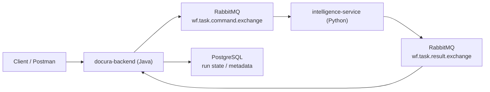

# Corvanta // Async Workflow Control Plane

> Two services. One message contract. Zero direct Java-to-Python coupling.

Corvanta is the root workspace that orchestrates:

- `docura-backend` (Java 17 + Spring Boot): API, workflow orchestration, RabbitMQ producer/consumer
- `intelligence-service` (Python 3.12+): async worker that consumes task commands and publishes task results

RabbitMQ is the runtime handoff boundary.

---

## Topology



---

## Boot Sequence

1. Clone root workspace:

```bash
git clone git@github.com:sarathkumar365/Corvanta.git
cd Corvanta
```

2. Fetch module repositories (clone missing, update existing):

```bash
corvanta bootstrap
```

3. Start both services:

```bash
corvanta start all
```

4. Check runtime status and logs:

```bash
corvanta status all
corvanta logs all
corvanta logs java --app --follow
```

---

## Command Deck

```bash
corvanta start [all|java|python]
corvanta stop [all|java|python]
corvanta restart [all|java|python]
corvanta status [all|java|python]
corvanta logs [all|java|python] [--follow] [--app] [--errors]
corvanta bootstrap [--clone-only]
```

High-signal log views:

```bash
corvanta logs java --app --follow
corvanta logs python --app --follow
corvanta logs all --errors --follow
```

---

## Global CLI (Optional)

To run `corvanta` from anywhere:

```bash
echo 'export PATH="/Users/sarathkumar/Projects/Corvanta/scripts:$PATH"' >> ~/.zshrc
source ~/.zshrc
```

Without PATH setup:

```bash
/Users/sarathkumar/Projects/Corvanta/scripts/corvanta start all
```

---

## Runtime Artifacts

Generated under `.run/`:

- `docura-backend.pid`
- `intelligence-service.pid`
- `docura-backend.log`
- `intelligence-service.log`

Behavior:

- Repeated `start all` does not create duplicate service processes.
- Each service log is cleared when that service starts/restarts.

---

## Repository Layout

- Root repository: `git@github.com:sarathkumar365/Corvanta.git`
- Backend module: `git@github.com:sarathkumar365/docura-backend.git`
- Worker module: `git@github.com:sarathkumar365/intelligence-service.git`

---

## Control Docs

- Cross-project coordination and handoffs: `coordination/`
- Shared RabbitMQ contract: `coordination/RABBIT_CONTRACT.md`
- Service management details: `scripts/DEV_SERVICES.md`
- Module-specific engineering standards: each module's `AGENTS.md`
